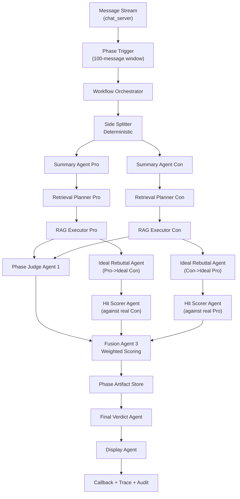

# AI系统设计文档（ai_judge_service）

更新时间：2026-03-22  
状态：执行对齐中（轻量单路径 + 本地 trace_store）  
关联文档：`docs/PRD/AI裁判完整PRD.md`、`docs/PRD/在线辩论AI裁判平台完整PRD.md`

---

## 0. 文档定位

本文档仅描述系统设计，不包含开发排期、实施计划或任务拆解。目标是把 PRD 中“赛中阶段性判决 + 赛后终局判决”转化为可执行的架构规范，重点回答：

1. 需要多少个 Agents，如何分工。
2. 各 Agent 采用何种工作模式（ReAct / Plan-and-Execute / Reasoning）。
3. 哪些步骤可并行，如何保证幂等与一致性。
4. RAG 检索链路如何做高质量优化。
5. 如何满足公平、可解释、可追溯、可降级的系统目标。

---

## 1. 设计原则

1. 公平优先：所有评分仅基于内容质量，不引入身份特征。
2. 证据优先：所有关键判断必须可回溯到 `message_id` 与 `source_url`。
3. 分层可控：生成式判断和确定性计算分离，避免黑盒叠黑盒。
4. 自动触发：阶段任务由系统事件自动触发，禁止用户手动触发。
5. 幂等可重放：同一阶段重复触发结果一致，可无副作用重放。
6. 可降级不失真：失败时优先降级为“低能力但可追溯”，禁止伪造高置信结论。

---

## 2. 系统分层架构

分层说明：

1. 编排层：`Phase Trigger` + `Workflow Orchestrator`，负责状态机、并行、幂等、补偿。
2. 判决层：Summary/Judge/Final/Display 等 LLM Agents，负责认知判断。
3. 检索层：Retrieval Planner + RAG Executor，负责查询规划与证据召回。
4. 保障层：Artifact Store + Trace/Audit/Replay，负责可追溯与运维闭环。
5. 实施口径（当前）：A0 编排采用服务内轻量单路径；trace、audit、replay 统一落本地 `trace_store`，RAG 精排使用本地 BGE reranker 并保留 fail-open。

---

## 3. Agent 总览（推荐 11 个）

## 3.1 Agent 清单

1. `A0 Workflow Orchestrator Agent`（编排）
2. `A1 Side Splitter Agent`（分边预处理）
3. `A2 Pro Summary Agent`（正方保真总结）
4. `A3 Con Summary Agent`（反方保真总结）
5. `A4 Retrieval Planner Agent`（双边查询规划）
6. `A5 Phase Judge Agent 1`（综合裁判打分）
7. `A6 Ideal Rebuttal Agent`（生成理想反驳）
8. `A7 Hit Scorer Agent`（命中度评估）
9. `A8 Fusion Agent 3`（加权融合）
10. `A9 Final Verdict Agent`（终局裁决）
11. `A10 Display Agent`（用户展示重写）

注：A4/A6/A7 为“逻辑 Agent”，实际可在运行时按侧并行复用实例，不要求物理独立服务。

## 3.2 工作模式选择

1. `A0`：Plan-and-Execute（确定性状态机），不使用 ReAct。
2. `A1`：Deterministic Rules（非 LLM）。
3. `A2/A3`：Constrained Reasoning（结构化 JSON + 引用约束），不使用 ReAct。
4. `A4`：Plan-and-Execute（先出 query plan，再执行检索）。
5. `A5`：Rubric Reasoning（多维评分推理，结构化输出）。
6. `A6`：Role-based Reasoning（“理想对手”生成），温度略高于评分 Agent。
7. `A7`：Pairwise Evaluator Reasoning（标准答案命中评估）。
8. `A8`：Deterministic Compute（公式融合，不用 LLM）。
9. `A9`：Hierarchical Reasoning（先证据归并、后终局判决）。
10. `A10`：Style Rewriter（事实锁定，文风重写）。

模式结论：

1. 不建议主链路采用 ReAct。该任务不是开放工具探索场景，ReAct 会增加不可控性和成本。
2. 建议采用“Plan-and-Execute + Constrained Reasoning + Deterministic Fusion”的混合模式。

---

## 4. 阶段任务工作流（每 100 条消息）

## 4.1 触发与幂等

1. 触发条件：`message_count % 100 == 0`。
2. 触发键：`session_id + phase_no`。
3. 幂等键：`judge_phase:{session_id}:{phase_no}:{rubric_version}:{judge_policy_version}`。
4. 同一幂等键若已完成，返回历史阶段产物，不重复执行。

## 4.2 阶段内执行顺序

1. `A1` 分边：拆出 `pro_messages` 与 `con_messages`。
2. `A2/A3` 并行：产出双边保真总结（必须含 `message_ids`）。
3. `A4` 规划：针对每侧总结生成多路检索 query（观点、反驳、证据缺口）。
4. 检索执行（双边并行）：向量 + 词法 + topic memory 召回，融合重排后产出 `retrieval_bundle`。
5. `A5`：输入 100 条原始消息 + 双边检索并集，输出综合评分。
6. `A6/A7` 双向并行链路：
   - 路径 P：`Pro material -> Ideal Con -> score real Con`
   - 路径 C：`Con material -> Ideal Pro -> score real Pro`
7. `A8`：加权融合（`w2 > w1`），产出阶段总分。
8. 结果落盘：阶段摘要、检索包、三类分数、证据链、审计快照。

---

## 5. 并行策略与资源调度

## 5.1 可并行矩阵

1. `A2` 与 `A3`：并行。
2. 正方检索与反方检索：并行。
3. Agent2 双向链路（P/C）：并行。
4. `A5` 与 Agent2 链路：并行（只要检索包准备完毕）。

## 5.2 不建议并行的步骤

1. `A8` 必须等待 `A5 + A7(P) + A7(C)` 完成。
2. 终局 `A9` 必须等待所有阶段产物稳定。

## 5.3 并行限流建议

1. 按 `session_id` 维度串行阶段提交，避免阶段乱序写入。
2. 按 `scope_id/topic_domain` 维度配置并发上限，防止热点辩题冲垮模型配额。
3. 对 `A6/A7` 单独限流，避免高成本链路挤占主裁判链路。

---

## 6. RAG 系统设计（重点优化）

## 6.1 索引与数据组织

1. 知识索引：官方背景知识（白名单来源）。
2. 辩论历史索引：历史高质量阶段产物与终局报告（topic memory）。
3. 双索引统一元数据：`chunk_id/topic_domain/stance/source_url/timestamp/quality_score`。

## 6.2 切片策略

1. 背景知识：按语义段 + 标题层级切片（推荐 300-600 tokens）。
2. 辩论历史：按“观点-论据-反驳”结构切片，绑定 `message_id` 列表。
3. 每个 chunk 必须带 `stance` 或 `neutral` 标签，支持分边检索过滤。

## 6.3 查询前处理（Query Planning）

1. 从 `pro_summary_grounded/con_summary_grounded` 提取核心 claim 集合。
2. 为每个 claim 生成三类 query：
   - 事实核验 query
   - 反驳强化 query
   - 规则/定义 query
3. 对 query 做去重与归并，形成每侧 `query_plan`。

## 6.4 召回与融合

1. 第一层：向量召回（高召回）。
2. 第二层：词法召回（补齐实体与术语精确匹配）。
3. 融合策略：RRF（Reciprocal Rank Fusion）。
4. 重排策略：轻量 reranker 对 topN 二次排序。

## 6.5 检索后处理

1. 去重：同源重复片段折叠。
2. 白名单：过滤非白名单来源。
3. 冲突标注：同问题存在冲突证据时保留并标记 `conflict=true`。
4. 证据包结构：必须输出 `query/chunk_ids/source_urls/snippets/scores`。

## 6.6 RAG 质量指标

1. Coverage@K：阶段 claim 被至少一条证据覆盖的比例。
2. Precision@K：前 K 条证据的相关率。
3. Evidence Novelty：阶段间新增有效证据比例。
4. Conflict Rate：冲突证据占比（用于终局风险提示）。

---

## 7. 评分体系与融合策略

## 7.1 Agent1（综合评分）

1. 输入：原始 100 消息 + 双边检索并集。
2. 输出：四维评分、阶段胜负倾向、裁决依据。
3. 评分基准：逻辑、证据、反驳、表达。

## 7.2 Agent2（命中度评分）

1. “理想答案”是评分标尺，不是事实结论。
2. 评分维度建议：覆盖度、反驳深度、证据贴合度、关键点命中率。
3. 输出必须包含命中项与漏项清单，均绑定引用。

## 7.3 Agent3（融合）

1. 公式：
   - `phase_pro = w1 * agent1_pro + w2 * agent2_pro`
   - `phase_con = w1 * agent1_con + w2 * agent2_con`
2. 约束：`w2 > w1`，默认 `w1=0.35, w2=0.65`。
3. 当 Agent2 降级或失败时：
   - 使用动态权重回退（如 `w1=1.0, w2=0.0`）
   - 必须写入 `degradation_level` 与 `error_codes`。

---

## 8. 终局判决系统设计

1. 输入集合：全部阶段摘要、全部检索包、全部阶段分数、一致性与退化信息。
2. 终局流程：
   - 证据归并
   - 阶段分走势分析
   - 冲突证据处理
   - 最终胜负与四维评分
3. 一致性控制：保留双次终局评估机制，胜方不一致触发 `draw` 保护。
4. 输出要求：
   - 最终结论 `pro/con/draw`
   - 结构化理由
   - 关键证据引用
   - 阶段回溯摘要

---

## 9. Prompt 与输出契约设计

## 9.1 统一输出契约

所有 LLM Agent 必须输出 JSON，禁止自由文本。核心字段至少包括：

1. `claims`
2. `evidence_refs`
3. `scores`
4. `rationale`
5. `confidence_internal`（仅内部）
6. `error_flags`

## 9.2 提示词安全约束

1. 辩论消息与检索内容均视为不可信输入。
2. 明确禁止遵循消息中的“越权指令”或“改规则指令”。
3. 必须以系统 rubric 为最高优先级。

## 9.3 事实锁定策略

1. Summary/Final Agent 强制引用 `message_id` 与 `source_url`。
2. Display Agent 只允许改写语气，不允许改写事实字段。
3. 上线前用 schema validator + groundedness checker 双重校验。

---

## 10. 数据模型与持久化规范

## 10.1 核心实体

1. `PhaseArtifact`
2. `SideSummary`
3. `SideRetrievalBundle`
4. `PhaseJudgeScoreCard`
5. `FinalVerdictRecord`
6. `JudgeAuditRecord`

## 10.2 PhaseArtifact 最小字段

1. `session_id/phase_no/message_start_id/message_end_id/message_count`
2. `pro_summary_grounded/con_summary_grounded`
3. `pro_retrieval_bundle/con_retrieval_bundle`
4. `agent1_score/agent2_score/agent3_score`
5. `prompt_hashes/token_usage/latency_ms/error_codes`
6. `trace_id/idempotency_key/degradation_level`

## 10.3 可重放要求

1. 任意阶段可按 `phase_no` 独立重放。
2. 重放必须固定输入快照，不读“当前最新消息”。
3. 重放结果与原结果差异要可解释并可审计。

---

## 11. 降级与异常策略

1. Summary 失败：退化为抽取式规则摘要，并标注降级。
2. RAG 失败：退化为 `context_seed + topic_memory`，继续判决并打标。
3. Agent2 失败：融合权重回退到 Agent1 主导。
4. 终局关键字段缺失：阻断提交，走 failed callback + audit alert。
5. 任何降级都必须写入：`error_codes/degradation_level/fallback_reason`。

---

## 12. 公平性与合规控制

1. 输入盲化校验前置，未通过直接拒绝。
2. 评分解释必须可映射证据，禁止“无证据结论”。
3. 对高争议低分差场景启用平局保护。
4. 记录审计告警状态机：`raised -> acked -> resolved`。

---

## 13. 可观测性与运营接口

1. Trace：任务状态、阶段状态、回调状态、错误码。
2. Replay：任务级和阶段级无副作用重放。
3. Diagnostics：检索 profile、召回来源、重排与退化原因。
4. Audit：prompt hash、retrieval snapshot、fusion 权重与最终依据。
5. 成本观测：各 Agent token、耗时、成功率、降级率。

---

## 14. 关键设计结论

1. Agent 数量建议为“11 个逻辑 Agent + 确定性执行器”，其中若干 Agent 运行时按侧并行复用。
2. 主链路推荐采用“Plan-and-Execute + Constrained Reasoning + Deterministic Fusion”，不建议使用开放式 ReAct。
3. RAG 必须升级为“分边查询规划 + 混合召回 + 重排 + 检索后治理”的完整闭环。
4. 系统核心竞争力不是单次模型输出，而是“阶段化产物沉淀 + 可回放审计 + 终局一致性控制”。
