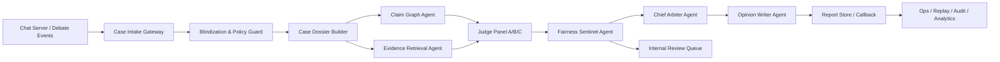

# AI_judge_service 企业级 Agent 服务设计方案（2026-04-13）

状态：已审核，可以实施  
设计前提：抛开当前实现，从产品需求与企业级可运营性重新设计  
目标：为“多人在线辩论 + AI 裁判 + 丰富判决展示 + 公正保障”设计一套真正面向产品主线的 Agent 服务

## 1. 一句话结论

如果 AI Judge 是你产品里的“裁决权核心”，那它不应该只是一个“调用大模型生成结果”的服务，而应该被设计成一套带有法院式分工、强公平门禁、可回放可复核、可持续校准的企业级 Agent System。

我的推荐不是单 Agent，也不是单 prompt，而是：

1. 用“法庭工作流”重构服务心智模型。
2. 用多 Agent 分工替代单一裁判。
3. 用公平门禁和内部复核替代“模型说了算”。
4. 用证据账本和裁决书替代“只给一个结果”。

一句话概括：`它应该像一个 AI 裁判庭，而不是一个 AI 评分器。`

## 2. 产品目标重新定义

基于你给出的需求，我把目标收敛成 4 条：

1. 输入是多人在线辩论房间中的完整发言，双方阵营为 `pro / con`。
2. 输出不是单一胜负，而是一份用户可理解、内容丰富、结构稳定的裁决结果。
3. 裁判必须尽量公正，至少要具备系统级的偏差抑制、冲突控制和内部复核能力。
4. 服务必须能企业级运行，能支撑版本演进、运营排障、回放复盘、灰度和成本控制。

因此，这个服务的本质不是“文本生成”，而是：

`对一场辩论进行受约束的、可解释的、可追责的 AI 仲裁。`

为了和最终产品 PRD 收口，我建议在设计层直接固定以下外部语义：

1. 正式公开结果集合：`pro / con / draw`
2. 保护性处理状态：`review required / blocked failed`
3. 北极星口径：辩论结束后 5 分钟内给出正式公开结果，或明确进入受保护复核状态
4. 判决可用率口径：成功进入终局结果或明确进入复核状态的案件占比 `>= 99%`

## 3. 为什么它必须是 Agent 服务

如果只做传统 LLM 服务，你很容易得到：

1. 一个最终结论
2. 一段看起来像理由的文案
3. 一些分数

但你很难真正保证：

1. 输入有没有被身份偏置污染
2. 模型有没有忽略关键反驳
3. 检索出来的背景知识有没有误导判决
4. 解释是不是事后编的
5. 同一场辩论重新判一次会不会翻车

这些问题决定了 AI Judge 必须具备 Agent 特征：

1. 能分阶段处理复杂目标
2. 能调用不同工具和子代理
3. 能在冲突时继续行动，而不是直接结束
4. 能形成完整裁决档案
5. 能进入内部复核流程

所以这里的 Agent 不是“会聊天的 AI”，而是“有职责分工、有状态、有工具、有门禁的执行系统”。

## 4. 总体设计理念

### 4.1 四个核心原则

1. `公平优先于表现力`
   - 漂亮的解释不等于公正。

2. `判决先锁事实，再生成文案`
   - 解释层不能反向改写裁决层。

3. `允许放弃，优于强判`
   - 当证据不足、冲突过大、偏差风险高时，系统应允许 `draw` 或 `review required`。

4. `任何重要结论都必须可回放`
   - 企业级裁判系统不能只有结果，没有证据链。

### 4.2 系统定位

这个新服务我建议定位为：

`AI Judge Court Service`

它不是单模型服务，而是一个“AI 裁判庭执行系统”，内部由多个 Agent 和多个基础子系统组成。

## 5. 推荐架构总览



## 6. 法庭式 Agent 分工

我建议把系统设计成 8 类核心 Agent。

### 6.1 Clerk Agent：收案与净化代理

职责：

1. 接收房间判决请求
2. 校验房间状态是否合法
3. 做输入规范化
4. 做字段级和语义级盲化
5. 生成 `case_dossier`

它负责回答：

1. 这场案子能不能判
2. 给裁判看的材料是否已经去除身份噪音

输出：

1. `case_id`
2. `transcript_snapshot`
3. `redaction_map`
4. `policy_version`
5. `rubric_version`

关键要求：

1. 不允许把用户画像、消费能力、历史胜率、昵称特征等带入裁判输入
2. 对显式和隐式身份信号做脱敏

### 6.2 Recorder Agent：庭审记录代理

职责：

1. 重建完整辩论时间线
2. 划分 phase / round / turn
3. 生成结构化 transcript
4. 标记每条发言属于哪一方、回应了谁、发生在哪个时间片

它不做裁判，只做“把原始聊天变成可裁判记录”。

输出：

1. `debate_timeline`
2. `turn_index`
3. `reply_links`
4. `phase_windows`

### 6.3 Claim Graph Agent：争点与主张图谱代理

职责：

1. 提取双方核心 claim
2. 提取 supporting points
3. 提取 rebuttals
4. 构建 claim-to-claim 对抗关系
5. 标记“未回应争点”“重复主张”“弱支撑主张”

这是整个系统最关键的一层。

为什么重要：

1. 它把裁判从“谁更像标准答案”拉回到“谁更好地提出、支撑、回应、驳倒主张”
2. 它能显著减少文风偏置

输出：

1. `claim_graph`
2. `claim_clusters`
3. `rebuttal_edges`
4. `unanswered_claims`

### 6.4 Evidence Agent：证据与背景核验代理

职责：

1. 判断哪些争点需要外部背景知识
2. 调用知识库 / 官方资料 / 白名单来源检索
3. 做来源过滤、冲突标记和证据摘要
4. 只提供“证据材料”，不直接给胜负

它不负责“替某一方找赢面”，而负责“为法官提供背景事实材料”。

输出：

1. `evidence_bundle`
2. `source_citations`
3. `conflict_sources`
4. `evidence_reliability_notes`

关键要求：

1. 来源必须白名单
2. 引用必须可追溯
3. 证据不足时应明确返回“证据不足”，不能强造知识

### 6.5 Judge Panel Agent：裁判团代理

这是核心裁判层，不建议只有一个法官，而应该至少有 3 个独立 Judge Agent。

#### Judge A：Logic Judge

关注：

1. 论证结构
2. 因果链完整性
3. 结论是否由前提推出

#### Judge B：Evidence Judge

关注：

1. 主张是否有证据支撑
2. 证据是否相关
3. 证据是否被误用或断章取义

#### Judge C：Rebuttal Judge

关注：

1. 是否真正回应对方核心主张
2. 是否抓住对方弱点
3. 是否存在“各说各话”

三个 Judge Agent 的关键设计要求：

1. 提示词族不同
2. 顺序视角不同
3. 可选不同模型或不同温度策略
4. 输出必须结构化，禁止直接写最终用户文案

每个 Judge 输出：

1. `side_scores`
2. `accepted_claims`
3. `rejected_claims`
4. `pivotal_turns`
5. `evidence_refs`
6. `judge_notes`

### 6.6 Fairness Sentinel Agent：公平哨兵代理

这是企业级设计里最不能少的一层。

职责：

1. 做阵营镜像测试
2. 做风格扰动测试
3. 做 identity scrub 前后结果对比
4. 检查裁判团分歧度
5. 检查解释是否脱离证据账本

它不负责定胜负，而负责问一句：

`这个结果能不能被信任？`

一旦触发以下情况，应阻断自动终局：

1. `label_swap_instability`
2. `style_shift_instability`
3. `judge_panel_high_disagreement`
4. `evidence_support_too_low`
5. `identity_leakage_detected`

输出：

1. `fairness_report`
2. `fairness_alerts`
3. `auto_judge_allowed`

### 6.7 Chief Arbiter Agent：首席仲裁代理

职责：

1. 汇总 Judge Panel 结果
2. 综合 fairness report
3. 决定最终状态：
   - `pro`
   - `con`
   - `draw`
   - `review_required`

4. 锁定最终裁决事实

这层是“判决层”，不是“解释层”。

输出：

1. `final_verdict`
2. `final_scores`
3. `winning_reasons`
4. `verdict_ledger`
5. `draw_reason` 或 `review_reason`

### 6.8 Opinion Writer Agent：裁决书代理

职责：

1. 基于 `verdict_ledger` 生成对用户可见的丰富展示内容
2. 保证语言可读、稳定、克制
3. 不允许编造 verdict ledger 中不存在的事实

这层负责把机器判决翻译成用户真正能读懂、也愿意读的裁决书。

输出不只是一个结果，而是一套完整展示结构。

## 7. 企业级核心数据对象

为了让这个服务真正能跑，我建议定义 6 个一级数据对象。

### 7.1 Case Dossier

表示一场待裁决案件。

包含：

1. room/session 元信息
2. transcript snapshot
3. redaction map
4. rubric/policy versions
5. input validation result

### 7.2 Claim Graph

表示双方争点、支撑和对抗关系。

包含：

1. claims
2. support edges
3. rebuttal edges
4. unresolved claims

### 7.3 Evidence Ledger

表示引用了哪些消息、哪些外部来源、哪些证据冲突。

包含：

1. message refs
2. citation refs
3. conflict refs
4. reliability labels

### 7.4 Verdict Ledger

表示最终裁决事实。

包含：

1. winner
2. side scores
3. dimension scores
4. accepted / rejected claims
5. pivotal moments
6. decisive evidence refs

### 7.5 Fairness Report

表示结果可信度与偏差门禁情况。

包含：

1. swap stability
2. style stability
3. panel disagreement
4. evidence sufficiency
5. review requirement

### 7.6 Opinion Pack

表示最终给用户和运营的展示包。

包含：

1. user-facing report
2. ops-facing audit summary
3. internal-only fairness details

## 8. 用户看到的“丰富判决内容”应该长什么样

你明确说了，不只是展示一个结果，而是丰富内容。  
所以我建议最终展示不是一段长文，而是一套分层内容。

### 8.1 面向用户的主展示

1. `最终判决`
   - 正方胜 / 反方胜 / 平局
   - 若未终局，则明确显示复核状态与原因说明

2. `总评分`
   - pro / con 两侧总分

3. `四维评分`
   - 逻辑
   - 证据
   - 反驳
   - 清晰度

4. `双方核心观点摘要`
   - 每方 3-5 条

5. `裁决理由`
   - 为什么判这方更优

6. `关键转折点`
   - 哪几个回合/哪几句发言真正改变了结果

7. `证据引用`
   - 关键 message 引用
   - 外部资料引用

8. `阶段摘要 / 争点展开`
   - 支持分页、折叠或分层浏览
   - 让用户能按阶段查看争点推进与回应情况

9. `裁判说明`
   - 例如：“本次裁决基于盲化后的辩论文本，不考虑用户身份信息。”

### 8.2 面向高级用户的展开层

1. `争点对照表`
   - 双方在主要争点上的对抗情况

2. `阶段摘要时间线`
   - 关键回合、关键回应与关键争点流转

3. `回应完整度`
   - 哪些主张被回应，哪些没有

4. `证据支撑图`
   - 哪些结论有直接证据，哪些证据不足

### 8.3 面向运营与内部复核的隐藏层

1. fairness alerts
2. panel disagreement
3. degradation reason
4. replay trace
5. model/rubric/policy version

注意：

1. 不向普通用户暴露 raw confidence
2. 不向普通用户暴露内部 prompt 和审计细节

## 9. 公平性保证机制

企业级 AI 裁判真正的难点在这里。  
我建议至少做 9 层保障。

### 9.1 输入盲化

1. 字段级盲化
2. 语义级脱敏
3. speaker normalization

### 9.2 风格归一化

1. 长度差异不直接奖励
2. 标点密度不直接奖励
3. 语气强弱不直接决定胜负

### 9.3 Claim-first Scoring

评分优先围绕：

1. 是否提出有效主张
2. 是否支撑主张
3. 是否回应对方
4. 是否完成驳斥

而不是围绕：

1. 谁写得更长
2. 谁更像知识库答案

### 9.4 多法官独立判断

1. 至少 3 个 Judge Agent
2. prompt family 独立
3. 可选模型独立

### 9.5 阵营镜像测试

把相同内容做 `pro/con` 对调再跑一次。  
如果结果大幅漂移，说明系统存在 label bias。

### 9.6 风格扰动测试

对文本做轻微 paraphrase / 去修辞 / 去冗余。  
如果结果大幅变化，说明系统对文风过敏。

### 9.7 证据充分性门禁

如果 decisive claim 的证据链太弱，不应强判。

### 9.8 受保护复核通道

对以下案件强制进入 `review required`：

1. 分差极低
2. panel 高分歧
3. fairness alert 高风险
4. evidence 不足

### 9.9 Benchmark 闭环

建立持续 benchmark，监控：

1. swap stability
2. style stability
3. citation precision
4. reviewer agreement
5. draw / review rate

## 10. 企业级工程架构

### 10.1 服务拆分建议

建议拆成 5 个可独立演进的子系统。

1. `Judge Gateway`
   - 接请求、鉴权、幂等、排队

2. `Judge Orchestrator`
   - 编排 Agent 工作流和状态机

3. `Judge Runtime`
   - 模型调用、tool 调用、prompt registry

4. `Judge Ledger Store`
   - case / claim / evidence / verdict / fairness / audit 存储

5. `Judge Ops Console`
   - 回放、复核、告警、观测、灰度

### 10.2 状态机建议

```text
queued
-> blinded
-> case_built
-> claim_graph_ready
-> evidence_ready
-> panel_judged
-> fairness_checked
-> arbitrated
-> opinion_written
-> callback_reported
-> archived
```

特殊分支：

1. `review_required`
2. `draw_pending_vote`
3. `blocked_failed`

补充约束：

1. 内部编排状态可以更细，但对外主语义应收敛为：处理中、已完成（`pro/con/draw`）、复核中、失败。
2. `draw_pending_vote` 是平台侧后续流程状态，不应回写成新的 AI 裁判公开结果。
3. 复核完成后，必须能稳定落到“维持原判 / 改判 / 转为 draw / 保留复核说明”四类对外结果之一。

### 10.3 存储建议

至少区分 4 类存储：

1. `OLTP DB`
   - jobs / case dossier / verdict ledger / callback receipts

2. `Object Store`
   - transcript snapshot / replay snapshot / full audit pack

3. `Search / Analytics Store`
   - fairness analytics / ops dashboard / replay queries

4. `Cache / Queue`
   - state machine / task scheduling / idempotency

### 10.4 事件驱动建议

关键事件：

1. `judge.case.received`
2. `judge.case.blinded`
3. `judge.claim_graph.ready`
4. `judge.panel.completed`
5. `judge.fairness.alerted`
6. `judge.verdict.finalized`
7. `judge.review.required`
8. `judge.report.published`

## 11. Agent Runtime 设计

真正的 Agent 服务不能把 prompt 写死在业务代码里。

建议建立：

### 11.1 Prompt Registry

管理：

1. prompt family
2. version
3. role
4. rollout scope

### 11.2 Tool Registry

至少包括：

1. transcript_reader
2. claim_builder
3. evidence_retriever
4. citation_verifier
5. label_swap_tester
6. style_perturbation_tester
7. fairness_scorer
8. replay_loader

### 11.3 Policy Registry

管理：

1. rubric version
2. fairness thresholds
3. draw policy
4. review escalation policy

### 11.4 Model Gateway

支持：

1. 多 provider
2. 多模型切换
3. 成本上限
4. 超时和熔断
5. shadow model

## 12. 企业级可靠性要求

### 12.1 运行态可靠性

1. 幂等请求
2. callback retry
3. failed callback
4. trace / replay
5. snapshot-based recovery

### 12.2 安全性

1. internal auth
2. tenant isolation
3. data retention policy
4. PII redaction 5.审计日志不可篡改

### 12.3 观测性

必须可观测：

1. end-to-end latency
2. model cost
3. panel disagreement
4. fairness alert rate
5. draw / review rate
6. callback success rate
7. replay volume

### 12.4 变更安全

1. prompt 灰度
2. rubric 灰度
3. shadow evaluation
4. canary rollout
5. benchmark gate

## 13. 我建议的对外接口模型

这里不写具体 OpenAPI，只给接口分层建议。

### 13.1 业务主接口

1. `POST /internal/judge/cases`
   - 提交裁判案件

2. `GET /internal/judge/cases/{case_id}`
   - 查询案件状态

3. `GET /internal/judge/cases/{case_id}/report`
   - 获取用户可展示报告

### 13.2 运维接口

1. `GET /internal/judge/cases/{case_id}/trace`
2. `POST /internal/judge/cases/{case_id}/replay`
3. `GET /internal/judge/cases/{case_id}/fairness`
4. `POST /internal/judge/cases/{case_id}/review`

### 13.3 策略接口

1. `GET /internal/judge/policies`
2. `POST /internal/judge/policies/rollout`
3. `GET /internal/judge/benchmarks`

## 14. 从当前 AI_judge_service 可继承能力到新架构的映射表

这一章专门回答一个现实问题：

`如果新方案成立，当前 AI_judge_service 里哪些东西应该继承，哪些应该升级后继承，哪些不该再当主链？`

我的结论不是“当前实现全部推翻”，而是：

1. 当前实现里的基础设施层，很多已经值得直接继承。
2. 当前实现里的若干裁判方法雏形，值得升级后进入新架构。
3. 当前实现里的部分启发式评分信号，不该再继续担任主裁决逻辑。

### 14.1 一页映射表

| 当前能力 / 逻辑                                                      | 当前作用                   | 新架构归属                                                        | 处理建议                   | 备注                                                         |
| -------------------------------------------------------------------- | -------------------------- | ----------------------------------------------------------------- | -------------------------- | ------------------------------------------------------------ |
| `phase / final` 分层                                                 | 先阶段汇总，再终局裁决     | `Recorder Agent` + `Chief Arbiter Agent` + `Opinion Writer Agent` | 升级后继承                 | 不一定保留旧命名，但保留“先形成阶段记录，再做终局判决”的思想 |
| `trace / replay / dispatch receipt`                                  | 任务追踪、回放、回执留痕   | `Judge Gateway` + `Judge Ledger Store` + `Ops Console`            | 直接继承                   | 这是企业级运维骨架，不应推翻                                 |
| `failed callback`                                                    | 将失败显式回传给调用方     | `Judge Gateway`                                                   | 直接继承                   | 应继续作为业务主链的一部分                                   |
| `audit alert / alert outbox`                                         | 风险与异常可追踪           | `Fairness Sentinel Agent` + `Ops Console`                         | 直接继承                   | 后续可扩展为 fairness / review 告警中心                      |
| `idempotency + retry + callback retry`                               | 防重与可靠投递             | `Judge Gateway` + `Judge Orchestrator`                            | 直接继承                   | 属于企业级必须能力                                           |
| `rubric_version / prompt hash / error_code / degradation_level`      | 裁判版本化与降级留痕       | `Policy Registry` + `Verdict Ledger` + `Fairness Report`          | 直接继承                   | 后续还应纳入 benchmark 分析                                  |
| 输入 `extra=forbid` + 敏感键拒绝                                     | 字段级盲化                 | `Clerk Agent`                                                     | 升级后继承                 | 保留字段级门禁，并增加语义级脱敏                             |
| `summary coverage guard`                                             | 防止总结脱离原始消息       | `Recorder Agent` + `Case Dossier Builder`                         | 升级后继承                 | 很适合成为“原始记录完整性门禁”                               |
| 混合 `RAG`、白名单来源、RRF、rerank、冲突标记                        | 为判决提供背景材料         | `Evidence Agent`                                                  | 升级后继承                 | 要从“命中加分器”升级成“证据核验器”                           |
| `agent2` 双向路径：生成理想反驳，再看目标方命中程度                  | 评估反驳质量               | `Judge Panel / Rebuttal Judge` 或 `Counterfactual Challenge Tool` | 升级后继承                 | 这是当前实现里最有创造力的雏形之一                           |
| `winner_first / winner_second / rejudge_triggered / draw protection` | 双次差异控制               | `Fairness Sentinel Agent` + `Chief Arbiter Agent`                 | 升级后继承                 | 后续要扩展成 swap/style/panel 多维稳定性检查                 |
| final 展示字段 `debateSummary / sideAnalysis / verdictReason`        | 对用户展示最终裁决         | `Opinion Writer Agent` + `Opinion Pack`                           | 直接继承结构、重写生成逻辑 | 字段设计对，内容生成方式要升级                               |
| `verdictEvidenceRefs / retrievalSnapshotRollup / phaseRollupSummary` | 证据链和过程展开           | `Evidence Ledger` + `Verdict Ledger`                              | 直接继承思路               | 后续应结构化而不是只做拼装                                   |
| `topic_memory` 存储能力                                              | 历史经验复用预留           | `Memory Store / Review Assistant`                                 | 暂不进入主链               | 先做 shadow memory，不直接影响胜负                           |
| 启发式信号：长度、标点、数字密度、token diversity                    | 快速估算逻辑/表达/证据强弱 | `Judge Diagnostics`                                               | 降级为辅助信号             | 不能继续做主裁决驱动器                                       |
| 检索命中条数对评分的直接影响                                         | 借助检索支持评分           | `Evidence Sufficiency Signal`                                     | 降级后继承                 | 只能做“证据充分性提示”，不应直接定胜负                       |
| final 模板化文案                                                     | 生成稳定展示结果           | `Opinion Writer Agent`                                            | 保留合同，重做写法         | 应改为 `verdict_ledger` 驱动，而不是模板拼句                 |

### 14.2 当前最值得继承的 5 个设计资产

如果只允许挑 5 项进入新方案，我会优先保留这 5 个：

1. `trace / replay / receipt`
   - 这是新架构能不能做复盘、复核、benchmark 的底座。

2. `RAG + source whitelist + conflict tagging`
   - 它已经具备成为 `Evidence Agent` 的雏形。

3. `agent2` 双向反驳命中逻辑
   - 它已经不是简单评分，而是在逼近“是否真正回应了对方最强点”。

4. `summary coverage guard`
   - 这是“裁判不得脱离原始发言”的关键保护。

5. `winner mismatch / draw protection`
   - 这是公平性系统最基础的自我克制机制。

### 14.3 `RAG` 在新方案里的正确位置

当前 `RAG` 最值得保留，但必须换位置。

当前容易出现的误用是：

1. 检索命中多，就更容易加分。
2. 更像 query 的表达，更容易获得检索支持。
3. 检索材料直接进入评分，而不是先进入证据核验。

在新方案里，`RAG` 应该进入 `Evidence Agent`，职责改成：

1. 判断哪些 claim 需要外部背景知识。
2. 为 claim 提供证据材料，而不是直接提供胜负倾向。
3. 生成 `source_citations / conflict_sources / evidence_reliability_notes`。
4. 将结果写入 `Evidence Ledger`，再由 Judge Panel 使用。

也就是说：

1. 保留当前混合检索能力。
2. 保留来源白名单。
3. 保留 rerank。
4. 保留冲突标记。
5. 取消“检索命中多就更强”这种隐式得分逻辑。

### 14.4 `agent2` 假设性专业回复逻辑在新方案里的升级方式

你现在这条逻辑的思想其实很好，不应该丢。

它当前的核心思想是：

1. 先根据一方观点生成“理想反驳”或“最强专业回应”。
2. 再检查对方发言有没有真正命中这些关键点。

这不是标准答案崇拜，而是在做一件更高级的事：

`检验一方是否真正回应了对方最强论点，而不是只做表面交锋。`

在新方案里，我建议把它升级成两种能力之一：

1. `Rebuttal Judge`
   - 专门负责“回应质量”维度。

2. `Counterfactual Challenge Tool`
   - 作为 Judge Panel 可调用的反事实挑战工具。

但有三个约束必须加上：

1. 不能把 AI 生成的理想回复当唯一 gold answer。
2. 不能让这条逻辑直接主导总胜负。
3. 必须结合 `claim_graph` 来判断命中的是不是核心争点，而不是命中某个漂亮表述。

所以它在新架构里最合适的角色是：

`高价值反驳质量探针`

而不是：

`终局裁判本体`

### 14.5 `summary coverage guard` 为什么应该升级，而不是删掉

你现在 summary 不只是“让模型总结一下”，而是会检查：

1. `message_ids` 是否来自原始输入
2. 覆盖率是否足够
3. 覆盖不足时是否回退到 grounded fallback

这件事非常重要，因为它在保护一个根边界：

`任何后续裁判动作，都不应该建立在一个脱离原始发言的幻想摘要上。`

在新架构里，这应该进入：

1. `Recorder Agent`
2. `Case Dossier Builder`

并升级成更完整的完整性门禁，例如：

1. summary coverage
2. claim coverage
3. pivotal turn coverage
4. rebuttal coverage

### 14.6 `winner mismatch` 在新方案里的扩展方式

当前逻辑已经做了最基础的一步：

1. 两套判断不一致，就触发 `draw` / `rejudge_triggered`

这条逻辑方向完全正确，但还不够。

在新方案里，它应升级为 `Fairness Sentinel Agent` 的 4 类检查：

1. `panel disagreement`
2. `label swap instability`
3. `style perturbation instability`
4. `evidence insufficiency`

也就是说，保留你现在的“冲突就别硬判”的克制精神，但把它从单一 mismatch 扩展成系统级 fairness gate。

### 14.7 哪些逻辑应该降级为辅助，而不能继续做主裁决

当前实现里有一些逻辑不是完全没用，但不适合继续担任主裁决驱动器。

我建议它们在新方案里统一降级为 `Judge Diagnostics` 或 `fallback signal`：

1. 平均消息长度
2. 标点密度
3. 数字密度
4. token diversity
5. 检索命中条数本身

这些信号可以帮助系统回答：

1. 这场辩论是不是过短
2. 这方是不是几乎没展开
3. 这轮是不是几乎没有证据引用

但它们不应该直接回答：

`谁赢了`

### 14.8 `topic_memory` 在新方案中的定位

当前 `topic_memory` 最适合保留为：

1. `shadow memory`
2. `review assistant memory`
3. `ops / benchmark analysis memory`

不建议它在新方案第一阶段直接进入主裁决链，原因很简单：

1. 它会把历史偏差带进当前判决。
2. 它会让“历史惯例”压过“本场表现”。
3. 在公平性 benchmark 没跑稳前，它更像偏差放大器。

所以新方案的推荐策略是：

1. 先保留存储能力。
2. 先只服务 review 与 analytics。
3. 等 benchmark 和 fairness gate 稳定后，再决定是否进入主链。

### 14.9 从旧系统到新系统的演进顺序

如果考虑现实迁移成本，我建议按下面顺序吸收当前能力：

1. 先无条件继承基础设施层
   - `trace / replay / receipt / failed callback / idempotency / audit`

2. 再吸收裁判方法雏形
   - `RAG`
   - `summary coverage`
   - `agent2 rebuttal probe`
   - `winner mismatch`

3. 最后淘汰或降级旧评分启发式
   - 长度
   - 标点
   - 数字密度
   - token diversity
   - 检索命中即加分

一句话总结这一章：

`当前 AI_judge_service 最值得继承的不是某个 prompt，而是几种已经成型的方法论雏形和一套很有价值的运维骨架。`

## 15. 可验证信任层与协议化扩展设计

这一章吸收 `EchoIsle-区块链-ZK-可验证思辨协议层未来蓝图-2026-04-08` 的有效部分，但只保留那些真正能增强裁判平台核心价值的设计。

核心原则不是“把 AI Judge 变成 Web3 产品”，而是：

`把 AI Judge 从可运维的企业级裁判系统，继续升级成可验证的制度系统。`

这里要特别克制两点：

1. 不把“上链”误当成“可信”。
2. 不把“协议化愿景”提前塞进近期主链，拖慢真实产品落地。

所以我建议把这一层拆成两部分：

1. `Verifiable Trust Layer`
   - 当前到中期就应该建设的可信承诺层。

2. `Protocol Expansion Layer`
   - 中远期才逐步开放的协议化扩展层。

### 15.1 为什么这一层值得加入

当前 Agent 方案已经解决了很多“怎么判”的问题，但还缺一个更高层的问题：

`别人为什么应该相信这套裁判制度没有赛后改口、暗改规则或偷偷换核？`

这正是可验证信任层的价值。

它不是为了增加概念，而是为了回答 5 个真正产品问题：

1. 结果能不能被证明没有被事后改动。
2. 这次裁决到底基于哪一版规则和哪一版 Kernel。
3. 申诉时能不能追溯到当时的案件快照和规则承诺。
4. 用户资格能不能被验证，但不暴露全部身份。
5. 平台未来能不能开放给学校、企业、DAO 运行自己的制度。

### 15.2 新增的系统定位

在原来的 `AI Judge Court Service` 上，再增加一个上层定位：

`Verifiable Deliberation Trust Layer`

它不替代主裁判链，而是包裹在主裁判链之外，负责：

1. 锚定关键事实
2. 固化规则版本
3. 承诺 Judge Kernel 版本
4. 为申诉、复核、组织制度扩展提供可信基础

### 15.3 总体分层

引入这层后，完整架构可以理解为 4 层：

1. `Execution Layer`
   - Clerk / Recorder / Claim Graph / Evidence / Judge Panel / Arbiter / Opinion Writer

2. `Ledger Layer`
   - Case Dossier / Evidence Ledger / Verdict Ledger / Fairness Report / Opinion Pack

3. `Verifiable Trust Layer`
   - Commitments / Attestations / Challenge State / Identity Proof Gateway

4. `Protocol Expansion Layer`
   - Constitution Registry / Reason Passport / Public Verification / Organization Forking

### 15.4 Verifiable Trust Layer 的 6 个核心组件

#### 15.4.1 Case Commitment Registry

职责：

1. 对每场案件生成不可变承诺
2. 固化 case 快照的关键哈希
3. 将“这次到底判的是哪份材料”固定下来

建议承诺内容：

1. `case_id`
2. `transcript_hash`
3. `evidence_hash`
4. `claim_graph_hash`
5. `rubric_version`
6. `policy_version`
7. `judge_kernel_version`
8. `created_at`

注意：

1. 这里只存承诺，不存敏感原文。
2. 这层即使不上链，也应先在平台内部做到不可随意篡改。

#### 15.4.2 Verdict Attestation Registry

职责：

1. 对最终公开结果生成裁决证明元数据
2. 绑定 `Judge Kernel` 的版本与输入输出
3. 为未来 `Verdict Proof` 做准备

建议固定内容：

1. `winner`
2. `public_scores`
3. `dimension_scores`
4. `kernel_input_hash`
5. `kernel_output_hash`
6. `verdict_ledger_hash`
7. `attested_at`

这里的关键理念是：

1. 不证明完整大模型推理过程。
2. 只证明最终公开结果来自承诺过的 `Judge Kernel` 和承诺过的输入。

这条路线比“证明整个 LLM”现实得多，也更适合产品落地。

#### 15.4.3 Challenge & Review Registry

职责：

1. 让申诉与复核流程成为制度化状态机
2. 防止平台对申诉流程口径漂移
3. 让“这次挑战到底发生了什么”可追溯

建议状态：

1. `not_challenged`
2. `challenge_requested`
3. `challenge_accepted`
4. `under_internal_review`
5. `verdict_upheld`
6. `verdict_overturned`
7. `draw_after_review`
8. `review_retained`
9. `challenge_closed`

建议固定内容：

1. `challenge_reason_code`
2. `supplemental_evidence_hash`
3. `review_policy_version`
4. `review_result_hash`

建议公开结果约束：

1. challenge / 复核的结束结果必须能映射回产品口径里的“维持原判 / 改判 / 转为 draw / 保留复核说明”。
2. challenge 历史应与 `Verdict Attestation Registry` 对齐，保证结果变更链可追溯。

#### 15.4.4 Judge Kernel Attestation

职责：

1. 把“最终公开评分器”从 Agent 层彻底分离
2. 固化对外声明的官方裁判内核
3. 让未来组织、学校、企业能明确知道自己采用了哪版裁判制度

建议把 `Judge Kernel` 定义成：

1. 输入：`claim_graph + evidence_ledger + fairness_gate_result + constitution/rubric`
2. 输出：`winner + public_scores + dimension_scores + verdict_reason_basis`

Judge Kernel 可以是：

1. 规则电路
2. 小模型
3. 规则 + 小模型混合评分器

但它必须满足：

1. 结构化
2. 版本稳定
3. 可承诺
4. 可审计

#### 15.4.5 Identity Proof Gateway

职责：

1. 让用户证明自己有参赛资格
2. 但不要求暴露全部身份

这层不进入当前裁判评分，只进入：

1. 资格校验
2. 分组准入
3. 赛事门槛
4. 组织成员验证

适用证明：

1. 学校学生资格
2. 企业成员资格
3. 年龄门槛
4. 唯一真人
5. 专业证书等级

关键边界：

1. 资格证明影响“能不能参加某类赛”。
2. 不允许影响“你在这场里该判几分”。

#### 15.4.6 Audit Anchor Export

职责：

1. 对平台内部审计日志做外部锚定准备
2. 为未来链上承诺或第三方公证保留出口

建议导出内容：

1. `case_commitment`
2. `verdict_attestation`
3. `challenge_state`
4. `fairness_summary`
5. `ops_review_trace_hash`

这层的意义是：

1. 先把可信结构整理好
2. 再决定是否接入链、公证服务或第三方审计网络

### 15.5 Protocol Expansion Layer 的 5 个方向

这一层不应该现在就全做，但应该在设计上预留接口。

#### 15.5.1 Constitution Registry

这是最值得纳入中期设计的协议层能力。

作用：

1. 允许不同组织定义自己的裁判哲学
2. 允许不同赛事定义不同价值排序
3. 允许不同场景使用不同申诉制度

可配置内容：

1. 评分权重
2. 证据标准
3. 伦理与违规边界
4. draw / review 阈值
5. challenge 机制

这层一旦成立，平台就不只是“一个官方裁判”，而是：

`一个可运行多套制度的裁判基础设施`

#### 15.5.2 Reason Passport

这是用户长期资产层，但要严格与当前场次裁判解耦。

它适合记录：

1. 赛季成绩
2. 领域能力标签
3. 反驳能力徽章
4. 证据质量标签
5. 长期参赛履历

严格规则：

1. 可作为长期声誉和资格资产。
2. 不直接进入当前单场判决输入。

否则会破坏裁判中立性。

#### 15.5.3 Public Verification Endpoint

未来可以开放：

1. `verify case commitment`
2. `verify verdict attestation`
3. `verify challenge state`
4. `verify constitution version`

这会把平台从“我们内部说自己可信”，推进到：

`外部也可以验证关键事实是否一致`

#### 15.5.4 Third-party Review / Jury Network

在更远阶段，可以允许：

1. 授权的人类评审团
2. 外部合作机构复核节点
3. 专业组织 reviewer

但这层必须建立在：

1. `Case Commitment`
2. `Challenge Registry`
3. `Judge Kernel Attestation`

这些先稳定之后，才有意义。

#### 15.5.5 On-chain Anchor / Proof Publishing

这是最远期的一层。

建议上链的只有：

1. 案件承诺哈希
2. 裁决承诺
3. Kernel 版本承诺
4. 申诉状态变更
5. 荣誉索引

不建议上链的内容：

1. transcript 原文
2. 音视频
3. 私密证据
4. 长文本解释
5. 用户隐私数据

所以这里要写得非常明确：

`链上只存承诺与凭证，不存敏感原文。`

### 15.6 与现有 Agent 方案的结合点

这章不是另起炉灶，而是直接增强已有 Agent 方案。

对应关系如下：

1. `Case Dossier`
   - 升级为 `Case Dossier + Case Commitment`

2. `Verdict Ledger`
   - 升级为 `Verdict Ledger + Verdict Attestation`

3. `Internal Review Queue`
   - 升级为 `Challenge & Review Registry`

4. `Policy Registry`
   - 未来升级为 `Constitution Registry`

5. `Judge Panel + Chief Arbiter`
   - 未来与 `Judge Kernel Attestation` 绑定

6. `Ops / Replay / Audit`
   - 增加 `Audit Anchor Export`

### 15.7 推荐的分阶段落地

#### Phase A：先做可信承诺，不碰链

目标：

1. 建立平台内部不可随意篡改的可信记录体系

范围：

1. `Case Commitment Registry`
2. `Verdict Attestation Registry`
3. `Challenge & Review Registry`
4. `Judge Kernel` 版本化
5. `Audit Anchor Export`

这一步最重要，因为它直接提升当前产品信任感，而且不需要引入任何 Web3 使用门槛。

#### Phase B：做公开可验证承诺

目标：

1. 让平台关键事实可被外部验证

范围：

1. `Public Verification Endpoint`
2. 轻量外部承诺锚定
3. 申诉状态公开可审计

#### Phase C：做资格证明与组织化扩展

目标：

1. 把产品从单一平台扩展到多组织制度基础设施

范围：

1. `Identity Proof Gateway`
2. `Constitution Registry`
3. `Reason Passport`

#### Phase D：再决定是否进入链上协议层

目标：

1. 在不伤害主产品体验的前提下，把可信承诺变成更强的公共基础设施

范围：

1. `On-chain Anchor`
2. `Verdict Proof`
3. `第三方 review 网络`

### 15.8 这章最重要的边界

为了防止方向跑偏，我会把边界写得很硬：

1. 可信层服务于裁判制度，不服务于概念包装。
2. 链是可选底层，不是产品主入口。
3. 钱包不应成为普通用户使用门槛。
4. ZK 先用于资格证明和结果承诺，不追求证明完整 LLM 推理。
5. 声誉层不得反向污染单场裁判中立性。

一句话总结这一章：

`AI Judge 的下一个壁垒，不只是判得更像人，而是让关键裁决事实变得可承诺、可验证、可扩展。`

## 16. 我建议你不要做的设计

为了让方案保持干净，我会明确写出不推荐项。

1. 不要做单法官单 prompt 裁判
   - 太脆弱，也无法支撑公正叙事。

2. 不要把用户画像喂给裁判
   - 这会直接污染中立性。

3. 不要让 explanation 代理反向改 verdict
   - 否则解释会变成“合理化”。

4. 不要过早启用 topic memory 主链
   - 历史偏差会被放大。

5. 不要为了“结果稳定”压制 `draw` 和 `review`
   - 能承认不确定，是系统成熟的表现。

## 17. 推荐落地路线

### Phase 1：Enterprise MVP

目标：

1. 先做出真正像“裁判庭”的主链
2. 不追求复杂学习系统

范围：

1. Clerk Agent
2. Recorder Agent
3. Claim Graph Agent
4. Evidence Agent
5. 3 Judge Panel
6. Fairness Sentinel
7. Chief Arbiter
8. Opinion Writer
9. trace / replay / review queue

### Phase 2：Fairness Hardened

目标：

1. 把公平性从原则变成量化工程

范围：

1. label swap testing
2. style perturbation testing
3. benchmark suite
4. fairness dashboard
5. shadow evaluation

### Phase 3：Adaptive Judge Platform

目标：

1. 从“能判”升级到“会持续变好”

范围：

1. policy auto-calibration
2. multi-model panel
3. benchmark-driven rollout
4. domain-specific judge families

## 18. 最后的产品判断

如果这个设计落地成功，你得到的将不是一个“生成裁判结果的服务”，而是一套：

1. 能对辩论做结构化审理的系统
2. 能把判决写成可信裁决书的系统
3. 能对公平性持续施压和复盘的系统
4. 能被企业放心接入主业务链路的系统

换句话说，它应该达到的不是：

`这个 AI 能不能像裁判说话`

而是：

`这个 AI 系统能不能像一个有制度的裁判庭那样工作`

这才是我认为配得上你产品主线定位的 `AI_judge_service`。
