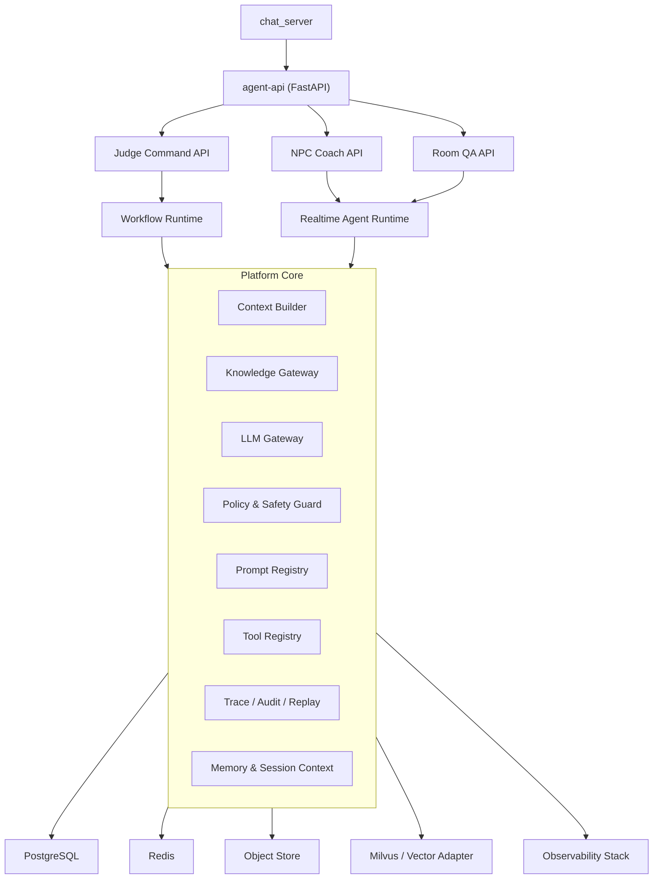

# AI_Judge_Service 架构与技术栈决策方案（2026-04-13）

状态：已拍板  
目标：为 `ai_judge_service` 确定可落地的架构、技术栈、框架与关键技术决策，并兼顾未来 `AI NPC` 与 `辩论间问答 Agent` 扩展

---

## 1. 一句话结论

我的建议不是把 `ai_judge_service` 做成一个越来越胖的 prompt 服务，而是把它演进为：

`一个以裁判为核心、以共享能力平台为底座的 Debate Agent Platform。`

短期对外名字仍可保持 `ai_judge_service`，但内部架构要从现在的“FastAPI + pipeline 脚本堆叠”升级成：

1. 一个内部统一的 Agent Platform Core
2. 三个上层 Agent App
   - `Judge App`
   - `NPC Coach App`
   - `Room QA App`
3. 两种运行平面
   - `异步工作流平面`：服务裁判、复核、回放、审计
   - `低延迟交互平面`：服务 NPC 与问答

这个方向的核心价值是：

1. 当前 AI 裁判不会被未来新 Agent 功能反向污染
2. 未来 `NPC / 问答 Agent` 不需要另起一套检索、上下文、提示词、审计和模型调用基础设施
3. 公平性、证据链、规则版本、复核与可信记录能继续作为平台级能力复用

已拍板前提：

1. 产品尚未上线，不保留兼容层、灰度路径、双写或旧新并行主链。
2. 只要当前仓库内调用方能在同一轮一起更新，就默认一步到位硬切。
3. 当前仍是本地开发阶段，任何需要真实线上流量、压测样本、长期延迟分布或真实用户数据校准的事项都先保留，不阻塞主架构重建。

---

## 2. 关键产品约束

这份方案必须同时满足两份 PRD 已经明确的约束。

### 2.1 裁判主线不能变

1. AI 裁判的正式公开结果只能是 `pro / con / draw`
2. 高争议或高风险案件允许进入受保护复核状态
3. 裁判输出不是一个胜负，而是一份富内容、可解释、可追溯的官方裁决报告
4. 判决必须强调公平性、输入盲化、证据链与规则版本

### 2.2 平台主线不能变

1. `chat_server` 仍然是客户端唯一门面
2. 投票、二番战、受约束 challenge 等平台编排不应错误下沉到 AI 裁判内核
3. 用户在辩论期间的体验是实时的，因此未来 `NPC / Room QA` 需要低延迟响应

### 2.3 未来扩展不能把裁判污染掉

未来的 `AI NPC` 和 `辩论间问答 Agent` 可以共享知识能力，但它们不能破坏“官方裁决”的中立性。  
所以架构上必须强制分出两条语义线：

1. `Official Verdict Plane`
   - 官方裁判线
   - 强审计、强版本化、强证据链
2. `Interactive Guidance Plane`
   - NPC 辅助线 / 问答线
   - 面向用户互动、低延迟、可个性化

这两条线可以共享底层能力，但不能共享“可写的裁决状态”。

---

## 3. 对当前现实的判断

我先直接下判断，不绕弯：

### 3.1 当前技术现实

从现有代码看，`ai_judge_service` 已经有这些不错的基础：

1. Python 3.11 + FastAPI + Pydantic v2 已经跑起来了
2. `phase/final` 契约、callback、trace、replay、RAG、Milvus、Redis 都已经有雏形
3. 输入盲化、error code、degradation、audit alert、failed callback 这条治理链是有价值的

### 3.2 当前主要问题

但它也有明显的架构天花板：

1. 业务逻辑过度集中在 `app_factory.py / phase_pipeline.py / trace_store.py`
2. 缺少真正的领域分层，模型调用、RAG、回调、存储、流程控制互相缠绕
3. 缺少 durable system of record，当前 `trace/idempotency` 仍偏 Redis / 内存式思路
4. 没有为未来 `NPC / 问答 Agent` 预留清晰的共享平台层
5. 还不是一个真正意义上的“多 Agent 平台”，而是一个不断加功能的 judge workflow

结论很明确：

`不能继续在现有 pipeline 上横向加功能。`

要做的是：

`保留已有正确资产，但重建分层。`

---

## 4. 总体架构决策

### 4.1 总体形态：模块化单体优先，不先拆微服务

我的明确建议：

1. 近期不要把 `Judge / NPC / Room QA` 拆成三个独立服务
2. 先做成一个 `单仓 + 单领域服务 + 多运行单元` 的模块化单体
3. 当且仅当负载、团队边界、发布节奏明显不同，再做物理拆分

原因：

1. 三类 Agent 共享同一领域对象：辩题、房间、消息、知识库、规则版本、上下文构建、证据能力
2. 过早拆服务只会复制 prompt、检索、追踪、权限、审计和缓存逻辑
3. 目前产品仍处于快速演进期，接口频繁变动，模块化单体更利于硬切主链

### 4.2 运行形态：一个代码库，两个部署单元

我建议未来的部署形态是：

1. `agent-api`
   - FastAPI
   - 对内提供 HTTP / SSE 接口
   - 负责命令入口、查询入口、低延迟 NPC/QA 响应
2. `agent-worker`
   - 负责异步裁判、复核、回放、索引刷新、审计任务

这两个部署单元共享一套代码和领域核心，但运行职责不同。

已拍板补充：

1. `agent-api` 与 `agent-worker` 是同一服务的两个运行单元，不是两个独立产品服务。
2. 第一阶段允许先只部署单进程开发态，但代码结构必须按双运行单元组织。

### 4.3 统一门面：客户端永远不直连 AI 服务

这个决策我建议直接定死：

1. 客户端只连 `chat_server`
2. `ai_judge_service` 永远是内部服务
3. 即使未来有 `NPC / Room QA`，客户端也不直接打 AI 服务

原因：

1. 权限、会话、房间状态、用户身份都在 `chat_server`
2. WebSocket / 实时状态主链也已经在 `chat_server`
3. 如果客户端直接打 AI 服务，会把认证、限流、审计、状态同步问题复制一遍

---

## 5. 推荐目标架构



### 5.1 领域层拆分

我建议把服务按 4 层拆开：

1. `Application Layer`
   - Judge App
   - NPC Coach App
   - Room QA App
2. `Platform Core`
   - 上下文构建
   - 模型网关
   - 检索网关
   - 工具注册表
   - 提示词注册表
   - 安全与策略
   - Trace / Audit / Replay
3. `Domain Layer`
   - Case
   - Verdict
   - Review
   - Knowledge
   - Room Context
4. `Infrastructure Layer`
   - HTTP
   - DB
   - Redis
   - Milvus
   - Object Store
   - Callback / Event Adapter

### 5.2 为什么这套结构能兼容未来功能

1. `Judge App` 用的是“不可变案件快照”
2. `NPC Coach App` 用的是“当前房间上下文 + 知识库 + 辅助策略”
3. `Room QA App` 用的是“当前房间上下文 + 赛事状态 + 已生成的阶段摘要”

三者共享底层能力，但共享的不是“一个大 prompt”，而是：

1. 上下文构建器
2. 知识检索网关
3. 工具注册表
4. 模型网关
5. 策略与审计框架

---

## 6. 关键技术栈决策

### 6.1 语言

### 决策

1. 近阶段继续使用 `Python`
2. 近期基线继续兼容 `Python 3.11`
3. 目标升级版本可以规划为 `Python 3.12`，但不建议现在单独为 AI 服务先跳版本

### 原因

1. 当前代码已经是 Python，AI 生态、RAG、评测、embedding、rerank 都更顺手
2. 现在真正的瓶颈不在语言性能，而在架构分层与工作流治理
3. 单独升级 Python 版本会引入额外环境漂移，不是当前第一优先级

### 6.2 API 框架

### 决策

继续使用 `FastAPI`

### 原因

1. 现有服务已基于 FastAPI
2. 适合内部 HTTP API、健康检查、回放查询、内部管理接口
3. 对未来 `SSE/streaming` 也足够友好

### 6.3 数据校验与 DTO

### 决策

继续使用 `Pydantic v2` 作为所有外部契约与内部命令 DTO 的主框架

### 要求

1. API 请求/响应模型统一 `extra=forbid`
2. 外部契约 DTO 与内部领域对象分离
3. 裁判、NPC、问答三类 Agent 的输入输出都必须有显式 schema

### 原因

1. 这类服务最怕“字段随便加、语义慢慢漂”
2. 你现在已经在 phase/final 契约上走到了正确方向，应继续强化

### 6.4 数据库

### 决策

引入 `PostgreSQL` 作为系统事实源（source of truth）

并配套：

1. `SQLAlchemy 2.0`
2. `asyncpg`
3. `Alembic`

### 这是强决策，不建议犹豫

当前 `trace/replay/idempotency/receipt` 已经证明：

`AI_judge_service` 不是一个纯内存/纯 Redis 就能可靠支撑的服务。

第一批主事实源表直接定为：

1. `judge_jobs`
2. `case_dossiers`
3. `dispatch_receipts`
4. `judge_job_events`
5. `verdict_ledgers`
6. `review_cases`
7. `audit_alerts`
8. `replay_records`

### 原因

1. 裁判、复核、回放、可信记录天然要求强持久化
2. Redis 可以做加速，不应该做唯一事实源
3. 后续 `NPC / Room QA` 也会需要房间上下文快照与会话级持久记录

补充决策：

1. `prompt_versions` 与 `policy_versions` 第一阶段先采用代码仓注册表 + hash 固化，不进入第一批数据库主事实源表。
2. 等 Judge 主链稳定后，再决定是否将这两类 registry 升级为数据库管理对象。

### 6.5 Redis

### 决策

保留 `Redis`，但角色收缩为“加速层与协调层”，不做最终事实源

### Redis 的正确职责

1. 幂等锁
2. 短 TTL 状态缓存
3. 速率限制
4. 会话级临时上下文
5. 实时 Agent 的短期 memory

### Redis 不应承担的职责

1. 最终裁决账本
2. 唯一 replay 记录
3. 复核状态主链

### 6.6 对象存储

### 决策

引入 `S3 兼容对象存储`（本地可用 MinIO）

### 存什么

1. transcript snapshot
2. full evidence pack
3. replay snapshot
4. benchmark artifacts
5. 大型审计导出包

### 原因

1. PostgreSQL 不适合长期存放大对象快照
2. 裁判服务天生会产生大量“需要保留但不适合频繁热查”的归档对象

### 6.7 向量检索与知识库

### 决策

`Milvus` 可以继续保留为当前阶段的主向量后端，但必须退到 `Knowledge Gateway` 之后，不能再让业务逻辑直接依赖它。

已拍板结论：

1. 第一阶段不迁移 `pgvector`
2. 第一阶段继续保留 `Milvus + BM25 + rerank` 的混合检索主线
3. 所有上层 Agent 只依赖统一 `Knowledge Gateway`

### 进一步的约束

1. 只把“批准的知识语料库”放到向量层
2. 房间实时上下文不要一上来就丢进 Milvus
3. 所有 Agent 都通过统一检索接口取知识，不直接访问 Milvus SDK

### 原因

1. 你当前已经有 Milvus + BM25 + RRF + rerank 的积累，这个资产值得继承
2. 但未来是否继续用 Milvus、是否增加 pgvector，都不应该影响上层 Agent 代码

### 我不建议现在做的事

1. 不建议因为“统一技术栈”马上把 Milvus 全迁到 pgvector
2. 不建议让 NPC、问答、裁判都直接写一套自己的检索逻辑

### 6.8 工作流引擎

### 决策

目标架构必须具备“durable workflow”能力，但我不建议此刻为了上马而硬塞一个重量级框架。

我的建议是：

1. 先定义统一 `WorkflowPort`
2. 第一阶段实现 `Postgres-backed Orchestrator`
3. 第二阶段再评估是否切到 `Temporal`

已拍板结论：

1. 第一阶段直接落地 `Postgres-backed Orchestrator`
2. 不引入 `Celery / Dramatiq / RQ`
3. 不保留当前以内存或 Redis 为主的 workflow 兼容主链
4. `Temporal` 明确保留到后续阶段再评估

### 为什么不是直接上 Celery / Dramatiq / RQ

我明确不推荐它们作为终态主架构：

1. 它们适合“任务队列”，不适合“可回放、可审计、可复核的案件工作流”
2. 你的裁判流程不是一个 job，而是一条有状态机的 case workflow
3. 未来 `review / replay / benchmark / prompt versioning` 都需要 workflow 语义

### 为什么不现在就强推 Temporal

因为当前仓库没有 Temporal 基础设施，产品也还在快速演进期。  
现在最重要的是：

1. 先把领域边界和 durable workflow 抽象做对
2. 不要把开发节奏卡死在基础设施引入上

换句话说：

`现在要先解决“有没有工作流内核”，再决定“工作流内核具体是不是 Temporal”。`

### 6.9 Agent 框架

### 决策

不采用 `LangChain / LangGraph / LlamaIndex` 作为核心架构框架。

### 原因

1. 你的裁判系统是合同驱动、结果驱动、审计驱动，不是 demo 驱动
2. 你需要的是显式状态机、显式 DTO、显式工具注册，而不是隐式魔法链路
3. 未来要做公平性、证据链、规则版本、Judge Kernel，这类系统更适合自建轻量 Agent Runtime

### 正确做法

1. 自建 `LLM Gateway`
2. 自建 `Tool Registry`
3. 自建 `Prompt Registry`
4. 用显式 Python 类与 typed contract 组织 Agent

### 可接受的边界

1. 可以在离线评测或脚本层借用第三方库
2. 但不要让主生产链路绑死在这些框架上

### 6.10 模型网关

### 决策

建立统一 `LLM Gateway`，所有模型调用只能走这一层。

### 这一层要统一什么

1. provider adapter
2. retry / timeout
3. structured output
4. usage accounting
5. trace tagging
6. model policy
7. fallback policy

### 原因

1. 当前 OpenAI 调用已经是事实主线，但未来裁判、NPC、问答的模型可能不同
2. 如果模型调用散落在各模块里，后面根本没法做成本治理和策略切换

### 6.11 事件总线

### 决策

短期不把 Kafka 作为 `ai_judge_service` 的强依赖，但必须预留 `Event Adapter`。

### 原因

1. 当前主调用链仍是内部 HTTP dispatch + callback
2. 仓库里 `chat` 主线已经有 Kafka 能力，但 AI 服务现在没必要先把自己绑死在它上面
3. 真正需要的是“可接入事件总线”，而不是“必须 day-1 上 Kafka”

### 结论

1. 近期：内部 HTTP + outbox
2. 中期：如 `chat_server` 的 debate 主链明确事件化，再接 Kafka adapter

### 6.12 可观测性

### 决策

技术上采用两条线并存：

1. `OpenTelemetry + 结构化日志`
2. `领域级 trace/audit/replay 存储`

### 原因

1. OTel 解决系统级 tracing / metrics / logs
2. 领域级 `trace_store` 解决“这个案件为什么这么判、怎么 replay、怎么复核”
3. 两者不能互相替代

### 6.13 本地开发阶段约束

1. 当前阶段不定义基于真实线上样本的容量阈值、压测指标冻结值或成本阈值冻结值。
2. 当前阶段只要求架构支持后续压测与校准，不要求现在就完成真实数据闭环。
3. 所有需要真实环境数据才能下结论的条目，统一在后续“真实环境校准阶段”处理。

---

## 7. 面向未来功能的架构决策

### 7.1 AI NPC 应如何接入

`AI NPC` 的职责不是裁判，而是“辩论辅导与思路拓宽”。

所以它的架构必须满足：

1. 可以读取当前辩题知识库
2. 可以读取当前房间上下文与阶段摘要
3. 可以给用户建议
4. 但不能写入 `verdict_ledger`
5. 不能把个性化用户上下文反向喂给官方裁判

### 因此我建议

1. `NPC Coach App` 共享 `Knowledge Gateway / Context Builder / LLM Gateway`
2. 单独拥有自己的 `npc_policy_version`
3. 单独拥有自己的 `prompt bundle`
4. 结果默认标记为“辅助建议”，不是官方裁决

### 7.2 Room QA Agent 应如何接入

这个 Agent 的职责是回答：

1. 当前辩论进行到什么程度
2. 哪一方暂时更有优势
3. 我方还有哪些问题没回应
4. 现在的关键争点是什么

它比 NPC 更依赖“结构化房间状态”。

### 所以它需要复用这些能力

1. `Room Context Snapshot`
2. `Stage Summary`
3. `Claim / Issue Read Model`
4. `Knowledge Gateway`
5. `LLM Gateway`

### 但也要有严格边界

1. 它给的是“进行中判断”，不是官方终局裁决
2. 它可以引用阶段摘要，但不能提前暴露内部审计与裁判门禁细节
3. 它的输出应标记为“实时辅助视图”

### 7.3 为什么这两类 Agent 不能和 Judge 混成一个大 agent

因为三者的优化目标不同：

1. `Judge` 优先公正、可解释、可追溯
2. `NPC` 优先启发性、帮助性、实时性
3. `Room QA` 优先状态理解、总结能力、低延迟

如果混成一个统一 agent：

1. 裁判会被用户导向污染
2. 辅助回答会被官方裁判语气绑死
3. 审计边界会糊掉

所以正确做法不是“一套大智能体包打天下”，而是：

`共享平台能力，隔离应用策略。`

---

## 8. 建议的代码组织

```text
ai_judge_service/
  app/
    api/
      judge/
      npc/
      room_qa/
      ops/
    applications/
      judge_app/
      npc_app/
      room_qa_app/
    domain/
      case/
      verdict/
      review/
      room_context/
      knowledge/
    core/
      llm_gateway/
      knowledge_gateway/
      context_builder/
      prompt_registry/
      tool_registry/
      policy_guard/
      trace_audit/
      workflow/
    infra/
      db/
      redis/
      milvus/
      object_store/
      callback/
      events/
    main.py
```

### 关键原则

1. `api` 不写业务编排
2. `applications` 只编排用例，不直接依赖底层 SDK
3. `core` 放共享能力，不放具体场景 prompt
4. `infra` 只做适配器

---

## 9. 我明确不建议的路线

### 9.1 不建议继续“在现有 phase_pipeline 上加功能”

这样做会得到：

1. 裁判逻辑越来越难测
2. NPC / QA 只能复制一份半相似 pipeline
3. RAG、prompt、回调、追踪会继续纠缠

### 9.2 不建议现在就拆成多个独立 AI 服务

这样会过早付出：

1. 契约维护成本
2. 重复基础设施成本
3. 多服务一致性和治理成本

### 9.3 不建议让客户端直接连接 AI 服务

这会让权限、限流、房间状态和用户态都变复杂。

### 9.4 不建议把 Redis 继续当主存储

它适合加速，不适合做裁判制度系统的事实源。

### 9.5 不建议把 LangChain/LangGraph 当成主骨架

它们可以做实验，但不适合你的生产裁判主线成为黑箱。

---

## 10. 建议的落地顺序

### Phase A：先重建骨架

1. 引入 PostgreSQL 事实源
2. 建立 `Application / Core / Infra` 分层
3. 抽出 `LLM Gateway / Knowledge Gateway / Trace-Audit`
4. 保持现有 FastAPI 接口与 callback 主合同不破

### Phase B：重建 Judge 主链

1. 把 `phase/final` workflow 从 `app_factory/phase_pipeline` 拆进 `Judge App`
2. 把 `receipt / trace / replay / review` 收敛成领域模型
3. 将当前 RAG、agent2、winner mismatch 等有价值逻辑迁入共享平台能力

### Phase C：给未来 Agent 预留入口

1. 建立 `NPC Coach App` 空壳
2. 建立 `Room QA App` 空壳
3. 统一 room context snapshot 和 shared knowledge access

### Phase D：再决定是否引入 Temporal / Kafka adapter

这是基础设施升级，不应成为今天阻止重构的前置门槛。

---

## 11. 我建议现在先拍板的 12 个决策

1. 继续使用 Python + FastAPI + Pydantic v2
2. 近期 Python 基线保持 3.11，不单独先升 3.12
3. 引入 PostgreSQL 作为主事实源
4. 引入 SQLAlchemy 2.0 + Alembic
5. Redis 只做加速和协调，不做最终事实源
6. 引入对象存储承接快照和审计包
7. 保留 Milvus，但退到统一检索网关之后
8. 不采用 LangChain/LangGraph 作为主架构
9. 建立统一 `LLM Gateway`
10. 先做模块化单体，不拆 Judge/NPC/QA 微服务
11. 客户端永远通过 `chat_server`，不直连 AI 服务
12. 先定义 durable workflow 抽象，再决定是否升级到 Temporal

---

## 12. 最后的判断

如果只看“把当前裁判做出来”，你完全可以继续在现有代码上加功能。  
但如果把 `NPC` 和 `辩论间问答 Agent` 也算进来，那条路会很快撞墙。

所以我的真实建议是：

`从这一轮开始，不再把 ai_judge_service 当成“单功能裁判服务”，而是把它按“裁判优先的 Debate Agent Platform”来设计。`

这样做最大的好处不是“更酷”，而是：

1. 你未来扩功能不会每次都推翻主链
2. 公平性与官方裁决不会被互动型 Agent 污染
3. 架构能自然承接你已经在构想的长期蓝图
