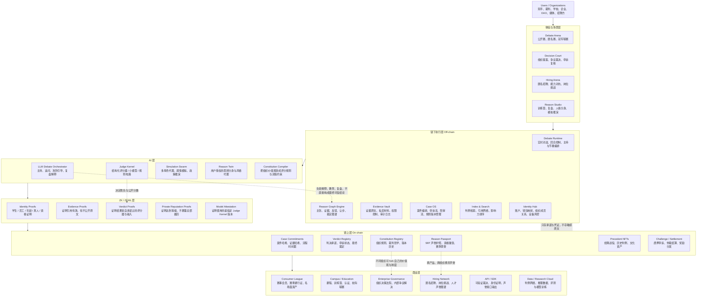

# EchoIsle 区块链、NFT、ZK 与可验证思辨协议层未来蓝图

> 沉淀时间：2026-04-08  
> 说明：本文为本线程讨论内容的整理沉淀稿，围绕 EchoIsle 与区块链、NFT、零知识证明、ZKML 的融合可能性，收敛为一份可长期复用的未来产品蓝图。

## 一、讨论起点

这次讨论不只停留在“功能还能加什么”，而是尝试把 EchoIsle 往以下四个层次推开：

- 产品形态
- 用户关系
- 商业空间
- 平台壁垒

在这个框架下，区块链相关能力不是为了“加一个 Web3 概念”，而是为了回答 EchoIsle 最核心的一个问题：

`主观裁决，如何变成可信事实？`

辩论平台最敏感的，不是聊天室、匹配、榜单这些表层能力，而是以下四件事：

- 结果是否可信
- 过程是否可审计
- 身份是否可验证但不必暴露
- 声誉是否可积累且可携带

区块链、NFT、零知识证明、ZKML 真正能发力的地方，正好就在这里。

如果方向选对，EchoIsle 不只是“加一个 Web3 功能”，而是有机会进化成一种新物种：

- `可验证思辨网络`
- `Verifiable Deliberation Protocol`

## 二、为什么区块链与 EchoIsle 天然契合

EchoIsle 处理的是“判断”与“公信力”，而区块链最擅长处理“不可篡改的记录”和“跨平台可信凭证”。

这个项目未来一定会碰到：

- 申诉
- 争议
- 黑箱评分
- 身份造假
- 刷榜
- 代打
- 隐私内容泄露

而 ZK 正是在“证明某件事为真，但不暴露原文”的层面有独特价值。

如果 EchoIsle 做大，真正的壁垒不会只是模型调用，而是以下四类资产：

- 裁判标准
- 对局数据
- 声誉网络
- 判例体系

这四个东西都特别适合上链或半上链。

## 三、最值得做的五个方向

### 1. 链上裁决指纹

每场辩论结束后，把以下信息做成链上承诺：

- transcript 哈希
- 证据哈希
- 裁判模型版本
- 评分 rubric
- 最终判决
- 时间戳

内容本身不上链，但任何人都能验证：

`这份结果没有被事后改过。`

这会极大提升 AI 裁判的可信度。

### 2. 辩手护照

把用户的以下信息做成可携带声誉凭证：

- 辩论成绩
- 风格标签
- 胜率
- 证据能力
- 反驳能力
- 连续参赛记录

这里更适合使用：

- `SBT`
- `不可转让 NFT`

因为这是身份与能力，不是收藏品。

### 3. 隐私资格证明

用户可以证明：

- 我是某学校学生
- 我是某公司员工
- 我年满 18 岁
- 我是唯一真人
- 我通过了某等级测试

但不必暴露：

- 真实姓名
- 完整证件
- 过多身份细节

这对以下场景非常强：

- 校园赛
- 企业赛
- 匿名辩论
- 招聘赛

### 4. 可验证申诉系统

当用户不服 AI 裁决时，可以进入 `challenge` 流程。

平台能证明：

- 官方裁决确实来自某一版规则
- 官方裁决确实来自某一版模型
- 本次输入与结果是绑定的

申诉方再提交补充证据。未来甚至可以引入：

- 人类评审团
- 陪审节点
- 质押仲裁

### 5. 动态 NFT 内容资产

如果要用 NFT，最有价值的不是卖图，而是把以下内容做成会随赛季和成绩更新的动态资产：

- 经典辩论瞬间
- 冠军赛季
- 名场面
- 历史判例

公共内容可以做可交易 NFT，个人声誉则保持不可转让。

## 四、真正的独特性：ZK + AI 裁判

最值得押注的方向，不是 NFT 本身，而是：

`可证明裁判`

也就是把 EchoIsle 从：

`相信平台说它公平`

推进到：

`平台可以证明它公平`

更现实也更有产品感的做法，是两层裁判系统：

- 第一层是大模型裁判，负责生成解释、点评、训练反馈、风格分析
- 第二层是一个更小、更结构化、可证明的“官方评分器”，只负责最终分数和胜负

这个小评分器可以基于结构化特征：

- 论点覆盖度
- 反驳命中率
- 证据引用质量
- 逻辑谬误惩罚
- 时间规则遵守
- 与论题一致性
- 攻防回合完成度

然后把这个小模型或规则电路的版本哈希固定下来，再生成证明：

`本场公开分数，确实是由承诺过的评分器，对承诺过的输入计算出来的。`

这件事一旦成立，EchoIsle 就不只是一个 AI 产品，而是一个：

`可验证评价基础设施`

大多数 AI 评测平台只能说“相信我”，EchoIsle 可以开始说：

`验证我。`

## 五、最疯狂但可能成为品类定义者的未来形态

### 1. 全球可验证辩论联赛

匿名参赛、ZK 验证资格、链上记录冠军历史、动态声誉护照、公开名场面 NFT、可申诉裁决。

它会像：

- 电竞
- 学术竞赛
- 链上荣誉体系

三者的混合体。

### 2. 匿名招聘辩论场

候选人不暴露姓名和背景，只证明自己满足某些资格，再通过真实辩论或案例攻防展示思维能力。

招聘方看到的是：

- reasoning
- 判断力
- 论证与反驳能力

而不是 pedigree。

### 3. DAO / 社区 / 企业的 AI 审议法院

把 EchoIsle 从“辩论产品”变成“争议解决与集体决策引擎”。

适用场景包括：

- 社区提案
- 组织争议
- 品牌公关分歧
- 内部决策

这些都可以在一个隐私保护但可审计的系统里完成。

### 4. 思想资产与判例网络

每一场高质量辩论，不只是一次内容消费，而是进入：

- 判例库
- 论证图谱
- 公共推理资产库

未来别人不是只来打辩论，而是来调用沉淀下来的：

`高质量论证资产`

## 六、不建议过早做的事

以下方向很容易沦为噱头，不建议在早期过早押注：

- 不建议一开始就发平台代币
- 不建议把原始 transcript、音视频、私人证据直接上公链或永久存储
- 不建议承诺“全链上大模型裁判”
- 不建议把钱包当成主入口

普通用户要的是：

- email 登录
- 手机号登录
- 社交登录

链应该是隐形底层，不应该成为使用门槛。

## 七、一个更完整的新物种定义

EchoIsle 不是一个“AI 辩论产品”，而是一个：

`可验证思辨层`

它服务的不是单一场景，而是一切：

- 需要判断
- 需要说服
- 需要裁决
- 需要申诉
- 需要信任但又不想暴露全部信息

的场景。

它像以下几种系统的混合体：

- 法院
- 议会
- 电竞联赛
- 招聘平台
- 知识市场
- DAO 治理系统
- AI 训练场

但核心只做一件事：

`把主观判断，升级成可验证的公共基础设施。`

## 八、这一新物种的六件套

### 1. Claim

任何论点、提案、争议、招聘题、公共议题都可以被结构化成链下内容、链上承诺的案件对象。

### 2. Evidence

证据默认不上链，只存：

- 哈希
- 签名
- 出处
- 权限说明

需要时可做选择性披露。

### 3. Reason Graph

不是只保存对话文本，而是保存：

- 主张
- 证据
- 反驳
- 让步
- 裁定

构成的推理图谱。

未来这是全平台最值钱的资产之一。

### 4. Verdict Proof

最终判决由官方评分器或官方小模型产出，并附带 ZK / ZKML 证明，证明：

`这份结果确实来自某个承诺过的规则、模型、证据集合和流程。`

### 5. Reason Passport

用户积累的不是普通积分，而是不可转让、跨平台可验证的：

- 思辨履历
- 风格标签
- 专业资格
- 赛季荣誉

### 6. Constitution Layer

不同组织可定义自己的价值优先级：

- 重逻辑
- 重证据
- 重伦理
- 重效率
- 重公众可接受性

从而形成：

`可 fork 的裁判哲学`

## 九、一页式未来架构图

下面这张图，把 EchoIsle 想成一个 `Verifiable Deliberation Protocol`，也就是“可验证思辨协议层”。

## 十、未来架构的逐层解释

### 链下层 Off-chain

这里是 EchoIsle 的现实世界操作系统。所有重量级内容都留在链下，包括：

- 实时辩论
- 音视频
- 私密证据
- 申诉材料
- 推理图谱
- 搜索索引

核心原则：

`原文不必上链，但关键事实必须可承诺、可回放、可审计。`

### AI 层

这里不是一个单一“大模型裁判”，而是多引擎分工：

- `LLM Debate Orchestrator` 负责主持、复盘、教学、追问
- `Judge Kernel` 负责最终公开分数与胜负
- `Simulation Swarm` 负责组织决策和公共议题模拟
- `Reason Twin` 负责用户思辨分身
- `Constitution Compiler` 负责把组织价值观编译成规则

关键原则：

`解释可以丰富，裁决必须可证明。`

### ZK / ZKML 层

这是品类定义能力的核心：

- 证明你有资格，但不暴露全部身份
- 证明你引用了真实证据，但不公开敏感原文
- 证明这次结果确实来自某个承诺过的评分器
- 证明你达到某种声誉等级，但不公开完整履历
- 证明平台没有偷偷切换裁判内核

关键原则：

`隐私不是黑箱，可信不是暴露。`

### 链上层 On-chain

这里不是数据库，而是“公共可信账本”：

- `Case Commitments` 锚定案件事实
- `Verdict Registry` 锚定裁决历史和申诉状态
- `Reason Passport` 锚定不可转让声誉
- `Constitution Registry` 锚定规则与价值观版本
- `Precedent NFTs` 锚定经典案例与文化资产
- `Challenge / Settlement` 支撑申诉、仲裁、激励

关键原则：

`链上存承诺、凭证、权利和历史，不存大体量敏感内容。`

### 商业层

最终不是卖技术，而是卖“可信思辨能力”：

- 面向 C 端，是联赛和身份荣誉系统
- 面向学校，是课程、认证和校际赛
- 面向企业，是内部争议解决和决策流程
- 面向招聘，是匿名能力对抗网络
- 面向开发者，是可验证裁决与声誉 API
- 面向研究机构，是高质量 reasoning 数据与判例云

## 十一、系统飞轮与核心资产

### 系统飞轮

1. 更多对局与案件进入链下执行层
2. 形成更强的推理图谱与判例网络
3. AI 裁判和 Judge Kernel 持续优化
4. ZK 证明让结果更可信
5. 链上护照与判例增强用户和组织的可携带资产
6. 商业场景扩展，反过来带来更多案件、更多规则、更多数据

这个飞轮可以收敛为：

`更多案件 -> 更强判例库 -> 更强裁判能力 -> 更高公信力 -> 更高组织采用率 -> 更多案件`

### 三项最值钱的资产

- `Reason Graph`
- `Judge Kernel + Verdict Proof`
- `Reason Passport`

## 十二、从 0 到 1 的演进说明

这里的“1”不是“加上钱包登录”或“发一个 NFT”，而是把 EchoIsle 推到一个新身份：

`从 AI 辩论产品，进化成可验证思辨基础设施。`

最重要的原则只有一句：

`先做可信裁决，再做链上凭证；先做真实需求，再做协议化扩张。`

### Phase 0：先把“裁判”做成产品核心

这一阶段完全可以不碰链。

目标不是证明会 Web3，而是证明用户真的在乎：

- 这场辩论判得公不公平
- 我为什么输
- 我能不能申诉
- 我的能力有没有被持续记录
- 这个平台是不是越来越懂“高质量思辨”

要先长出的能力：

- 结构化辩论流程，不只是聊天室
- 结构化评分维度，不只是模型自由发挥
- 可回放的案件对象 `Case`
- 可解释的裁判结果
- 可申诉的复核流程
- 可积累的用户能力画像

这一步的产物不是链上资产，而是三个底层资产：

- `Case OS`
- `Reason Graph`
- `Judge Kernel` 的雏形

### Phase 0.5：做“可审计”，但先不做“去中心化”

开始把每场案件的重要事实固化下来：

- transcript 哈希
- 证据哈希
- 评分 rubric 版本
- 裁判模型版本
- 最终分数
- 时间戳
- 申诉状态

这时不一定要公开上链，先在平台内部形成一套不可随意篡改的审计日志和案件快照机制。

用户第一次能感受到的变化是：

- 平台不能轻易改口
- 裁判结果有“版本”概念
- 申诉有明确依据
- 历史判决可追溯

这一阶段本质上是在建立：

`可信产品习惯`

### Phase 0.8：把“可信记录”升级成“公开可验证承诺”

这时才适合引入最轻量、最隐形的链能力。

上链内容只放：

- 案件承诺哈希
- 裁决承诺
- 裁判器版本承诺
- 申诉状态变更
- 赛季荣誉索引

不上链内容：

- 原始 transcript
- 音视频
- 私密证据
- 用户隐私信息
- 长文本分析结果

用户侧的感知应该非常简单：

- 这场比赛结果被永久锚定了
- 这份冠军记录不是平台能随便改的
- 这次争议确实进入了公开可审计流程

### Phase 1.0：推出第一代 `Reason Passport`

这是真正有产品辨识度的第一代链上能力。

不是发行可交易 NFT，而是建立：

- 不可转让的思辨声誉护照
- 赛季成绩与资格徽章
- 专题领域能力标签
- 裁判公信力标签
- 连续参赛、申诉成功率、证据质量等长期记录

这个阶段的关键不是投机，而是：

`声誉开始可携带。`

### Phase 1.2：引入 ZK 身份与资格证明

当产品进入校园赛、企业赛、匿名招聘、专业领域赛事，就会遇到真正的痛点：

`我要验证参赛资格，但我不想暴露完整身份。`

优先落地的能力包括：

- 证明自己是某学校学生，但不公开学号姓名
- 证明自己属于某公司或某组织，但不公开工号
- 证明年满 18 岁，但不公开生日
- 证明是唯一真人，但不暴露真实身份
- 证明拥有某证书或等级，但不公开全部证件细节

这一阶段，EchoIsle 开始出现非常强的差异化：

`不是匿名论坛，而是有资格证明的匿名竞技场。`

### Phase 1.5：把最终裁决做成“可证明结果”

这是从优秀产品跨向品类定义者的那一步。

这里不要试图证明整个大模型推理过程，更现实而强大的做法是：

- 大模型负责主持、解释、复盘、追问
- 一个更小、更结构化的 `Judge Kernel` 负责最终公开评分和胜负
- 平台对这个 Kernel 的版本做公开承诺
- 每场裁决生成 `Verdict Proof`

用户得到的是一种前所未有的信任体验：

- 你可以不喜欢结果
- 但你不能说平台赛后偷偷改规则
- 你能知道这次裁决来自哪一版评分器
- 你能发起 challenge，而不是只剩情绪争论

这一步完成后，EchoIsle 的核心叙事就变了：

不是“AI 帮你判”，而是：

`AI 的关键裁决过程可以被验证。`

### Phase 1.8：从辩论平台变成“制度引擎”

当有了可验证裁决、可携带声誉、可证明身份，下一步就不是继续加功能，而是开放“规则定义权”。

开始允许组织定义自己的：

- 评分权重
- 证据标准
- 伦理边界
- 申诉机制
- 资格条件
- 仲裁流程

这就是 `Constitution Layer`。

这时产品形态会爆炸式扩张：

- 学校可以开校际赛宪章
- 企业可以开内部争议裁决系统
- DAO 可以开提案审议法院
- 招聘方可以开匿名岗位挑战赛
- 媒体和社区可以开公共议题竞技场

从这里开始，EchoIsle 不再只是“比赛平台”，而是：

`别人拿来运行自己制度的基础设施。`

## 十三、最推荐的落地顺序

1. 先做 `Case OS + Reason Graph + Judge Kernel`
2. 再做 `审计日志 + 结果版本化`
3. 再做 `链上锚定`
4. 再做 `Reason Passport`
5. 再做 `ZK 资格证明`
6. 最后做 `Verdict Proof + Constitution Layer`

这个顺序的好处是：

- 每一步都有独立产品价值
- 没有一步是在为概念服务
- 哪怕中途停下，也已经形成差异化
- 越往后，越接近协议和基础设施形态

## 十四、最关键的前提与最终定位

这套蓝图成立的前提，不是“先发币”，而是先建立：

- 高质量裁判标准
- 高质量结构化数据
- 高质量申诉机制
- 高质量声誉体系

链、NFT、ZK、ZKML 只是把这些东西从“平台内部能力”变成“外部可验证能力”。

最终，EchoIsle 可以不是“AI 辩论平台”，而是：

`全球首个把思辨、裁决、声誉、申诉与组织治理统一到可验证协议层上的基础设施。`

也可以进一步概括为：

`思辨世界的 Stripe + Elo + Court + GitHub`

或者更完整地说：

`全球首个面向思辨、裁决与声誉的可验证协议层。`
